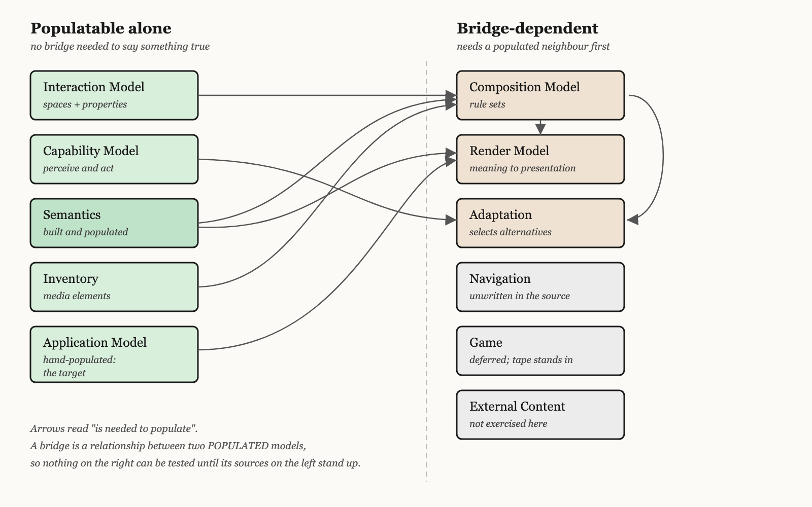
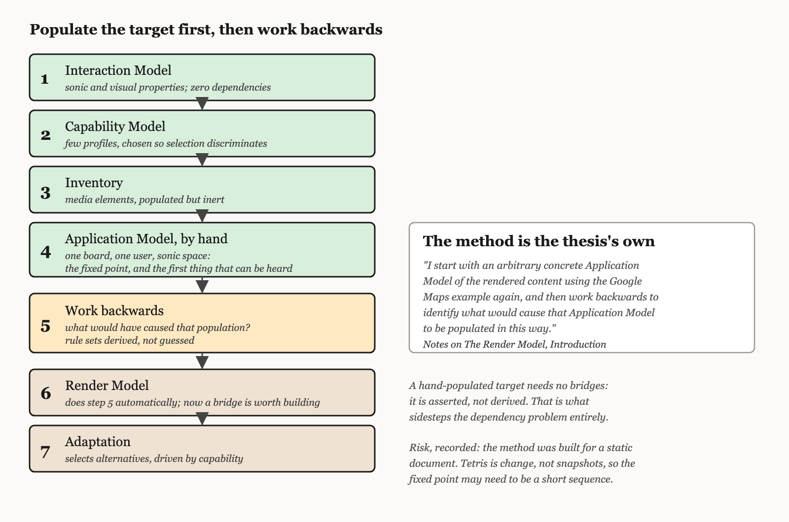

# Domains, populations, and where to start

**Status:** considered opinion, 2026-07-27. Requested by Bob; written by Claude.
Recorded under the collaboration discipline in [DEMOS.md §6a](DEMOS.md) and
logged in [docs/collaboration-log.md](../docs/collaboration-log.md).

## 0. The correction this document responds to

The programme in DEMOS.md put the cradle first and the bridge in it from the
start. That is premature, and the objection is methodological rather than a
matter of taste: **a bridge is a relationship between two populated models.**
Building one before either model has a population means the bridge is
speculative in both directions, and there is nothing to test it against.

The right unit of work is therefore the **domain**, considered independently,
populated with instances, and verified on its own terms. Bridges are what
happens after two neighbouring domains each stand up. This is the Shlaer-Mellor
discipline the CISNA model already sits inside, and the case study is explicit
that the five layers are "structurally a Shlaer-Mellor domain chart with peer
relationships rather than the canonical client-server hierarchy".

Issue #5 (does request/answer rendezvous compose with Render Model population?)
is therefore not the next question. It is a *bridge* question, and it cannot be
answered honestly until the domains either side of it are populated. Assuming it
composes, for now, is reasonable precisely because nothing yet depends on the
answer.

## 1. The domains

Eleven domains are in play. Their dependency is not uniform, and that is the
whole basis of the recommendation below.

**Independently populatable — no bridge required to say something true about them:**

| Domain | What a population looks like | Why it stands alone |
|---|---|---|
| **Interaction Model** | The Sonic and Visual Interaction Spaces, each with its Interaction Properties | Properties of a medium. Psychoacoustics does not depend on Tetris, on a user, or on any other model. |
| **Capability Model** (within User Profiling) | Default, blind, low-vision, hard-of-hearing profiles | Capacity to perceive and act. A property of people, not of content. |
| **Semantics** | Nouns, Verbs, Rules for Tetris | Already built and populated. Knows nothing of rendering. |
| **Inventory** | Timbres, water sounds, note sets, visual cells | A media element is a media element before anything selects it. |
| **Application Model** | A concrete board, presented, for one user | Can be hand-populated as a *target*. See §3. |

**Bridge-dependent — cannot be meaningfully populated until their neighbours are:**

| Domain | Waits on |
|---|---|
| **Composition Model** | Semantics + Inventory + Interaction. Its rule sets match Notions against metaphors against interaction properties, so all three must exist to match against. |
| **Render Model** | Semantics + Composition + Application Model. Its job *is* the bridge from meaning to presentation. |
| **Adaptation** | Capability + the alternatives it selects among. Nothing to select from until Composition offers options. |
| **Navigation** | Semantics, and an unwritten part of the model (issue #4). |
| **Game** | Nothing, technically, but it is deferred by DESIGN.md §8 and replaced by the tape until phase 3. |
| **External Content** | Not exercised by this demonstrator: the game generates its own content. |

## 2. Where I think Bob is right, and where I would refine it

Bob's instinct was that the first Tetris work lies in the **Render Model**
(representations of modalities and metaphors), with the **User domain and
capabilities** needed to select modalities correctly.

I agree with both, with one refinement about sequencing.

**The Render Model is where the research is.** The contribution of this project
is not that Tetris can be implemented; it is how meaning becomes presentation
across design spaces. That is Render Model territory, and the phase-1 modality
demos are Render Model and Inventory work wearing demo clothes.

**But the Render Model is bridge-dependent**, and it is the *most*
bridge-dependent domain of the lot: it needs Semantics on one side, Composition
and Inventory beneath, and an Application Model to populate. Starting there
means starting with the domain that can least be tested alone.

The refinement is that this is a solved problem, and **the thesis already solved
it**, in the Render Model note's own opening move:

> "I start with an arbitrary concrete Application Model of the rendered content
> using the Google Maps example again, and then work backwards to identify what
> would cause that Application Model to be populated in this way."

That is the method. Hand-populate the *target* first, as a fixed point, then
work backwards to discover what must exist to produce it. It sidesteps the
dependency problem entirely, because a hand-populated Application Model needs no
bridges: it is simply asserted.

**So: do the Render Model work, but enter it the way the thesis did.**

## 3. Recommended order

**Step 1 — Interaction Model.** Smallest, zero dependencies, and it constrains
everything downstream. A metaphor is a choice about how to use a medium's
properties, so until the properties are declared, "metaphor" has nothing to
select against. Populate the Sonic Interaction Space with the dependable
properties (azimuth, pitch, loudness, tempo, timbre, consonance, voice identity)
and the weak ones (elevation at roughly five bands, reverberation, front/back),
each with its resolution and whether it is serial or parallel. Populate the
Visual Interaction Space alongside it, because the contrast is the argument: the
visual space is parallel and persistent, the sonic space is serial and
transient.

*This also completes something the thesis left open.* The note's Interaction
Model section is the one that trails off into "shown in XXX" against a figure
that was never drawn. Building it is new work, and must be reported as such
rather than as the model having specified it (§6a).

**Step 2 — Capability Model.** Also independent. Populate as the note's own
example did: a Default User and a Low Vision User to begin, then a blind user,
then a user with reduced high-frequency hearing. Small populations, chosen to
make selection *discriminate*: two profiles that would select identically test
nothing.

**Step 3 — Inventory.** Media Elements and Formatted Media Elements per
interaction space. The seven timbres, the water sound, the note sets, the
speaking voices. Populated but inert: nothing selects them yet.

**Step 4 — Application Model, hand-populated.** One concrete board, one user,
rendered into the Sonic Interaction Space, written by hand as the thesis wrote
the Google Maps rendering by hand. This is the fixed point everything else is
derived against, and it is the first artefact that can be *listened to*.

**Step 5 — work backwards.** With a target population in hand, ask the note's
question: what would have caused this? That produces the Composition Model's
rule sets as a *derivation* rather than a guess, which is the entire value of
the method.

**Step 6 — Render Model**, as the thing that performs step 5 automatically. Only
now is a bridge worth building, because both sides are populated.

**Step 7 — Adaptation**, selecting among alternatives the Composition Model can
now offer, driven by Capability.

## 4. The distinction that decides whether selection works

The note draws a line that is easy to miss and load-bearing:

- **Design space** (Nesbitt): visual, audio, tactile. Physical.
- **Interaction Space**: "a view of potentially many design spaces". A construct
  of the model, not of physics.
- **Capability Model**: "it is their capacity to perceive and to act that forms
  the Capability Model in my user profiling, **not directly the physical
  properties of the design space**".

So there are three separate things, and selection only works if they stay
separate: what the medium *offers* (Interaction Properties), what the person
*can use* (Capability), and what a metaphor *does with* the first to suit the
second. Collapsing capability into medium properties is the obvious modelling
shortcut and it would destroy the model's ability to adapt, because it would
make "blind" a property of audio rather than a property of a person.

Concretely for Tetris: azimuth resolution of 1–2° is an Interaction Property of
the sonic space. Whether *this listener* resolves 1–2° is Capability. A metaphor
that encodes column position as azimuth is betting the second is true of the
first, and the mixing desk exists because that bet is sometimes wrong.

## 5. What each population must be able to fail

A population that cannot be wrong tests nothing.

| Domain | The population fails if |
|---|---|
| Interaction Model | Two metaphors from the case study need a property it does not list, or it lists properties no metaphor ever uses. |
| Capability Model | Two profiles select identically for every metaphor, meaning the model does not discriminate. |
| Inventory | A media element cannot be described without reference to the metaphor that uses it, meaning the layers are not actually separate. |
| Application Model | The hand-populated board cannot express something the Semantics Layer says the game has. |
| Composition rule sets | Working backwards produces rules that only ever fire for the one board they were derived from. |

That last one is the real risk of the work-backwards method, and it is worth
stating in advance: deriving rules from a single example gives rules fitted to
that example. The mitigation is a second, deliberately awkward board (a nearly
full field, an overhang, an empty field) populated before the rules are trusted.

## 6. What I would defer, and why

**The bridge and rendezvous (issue #5).** Bob's assumption that it composes is
probably safe, but it is untestable now and cheap to revisit later. Deferring
costs nothing.

**Navigation (issue #4).** Genuinely unwritten in the source. It deserves its own
investigation once there is something to navigate, and it is a candidate for the
most novel contribution here, since Tetris has real traversal (tile, silhouette,
next, hold) that the Google Maps example never needed.

**The Game domain.** DESIGN.md §8 defers it and the tape replaces it. Nothing in
steps 1 to 7 needs it.

**Event Logging.** Issue #3 argues for instrumenting early. It is inside User
Profiling in the note's Figure 5, so it belongs to a domain being populated at
step 2, and adding it there is nearly free.

## 7. Where I may be wrong

Recorded because the collaboration record is only worth something if it includes
this.

- **The work-backwards method may not survive a real-time system.** It was
  designed for a static document. A hand-populated Application Model is a
  snapshot, and Tetris is not snapshots: the interesting content is *change*.
  It may turn out that the fixed point should be a short populated *sequence*
  rather than a board, which is a different and larger artefact.
- **I may be over-weighting the Interaction Model** because it aligns neatly
  with something already written up (the palette argument in the LinkedIn
  article). Convergence is satisfying and is not evidence.
- **Step 3 (Inventory) may be too early.** Media elements are cheap to make and
  hard to choose well, and choosing them before any metaphor has been tested
  risks a population that exists to be replaced.
