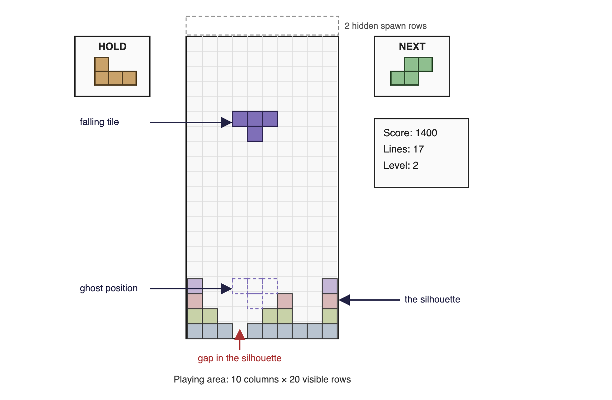
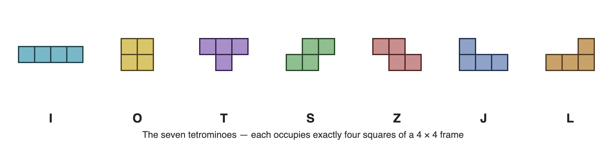
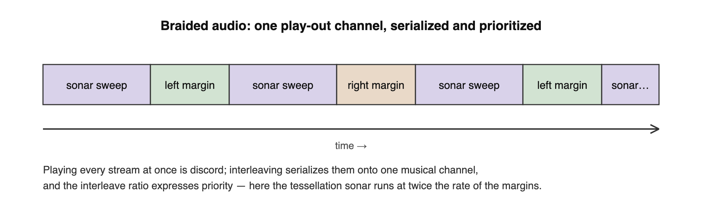
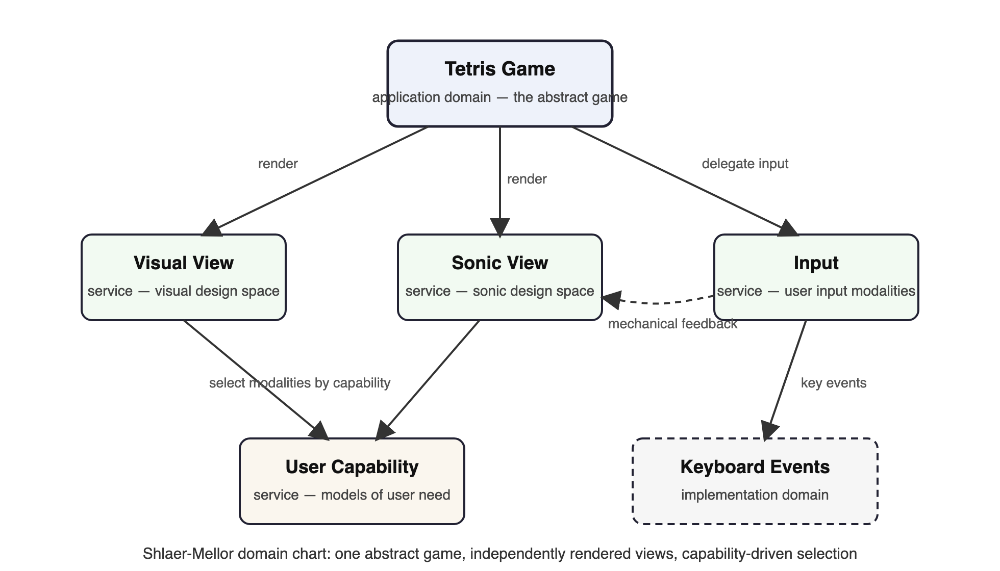
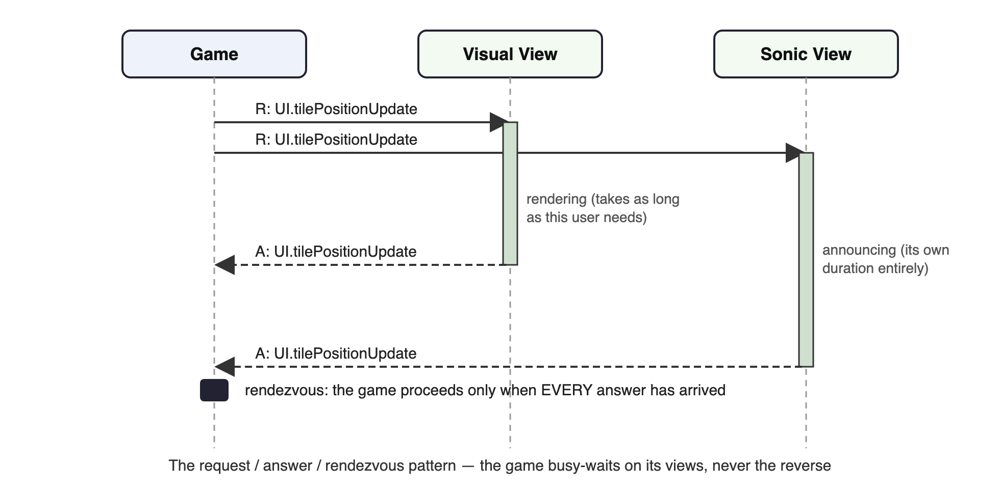
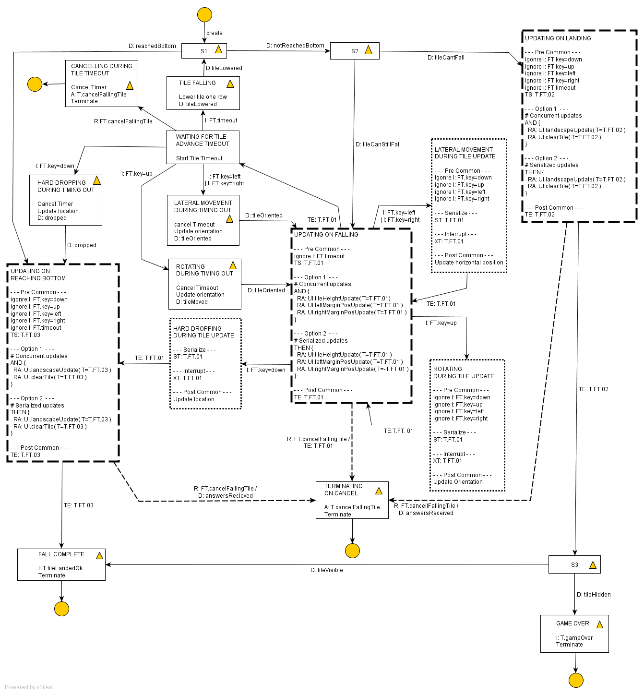
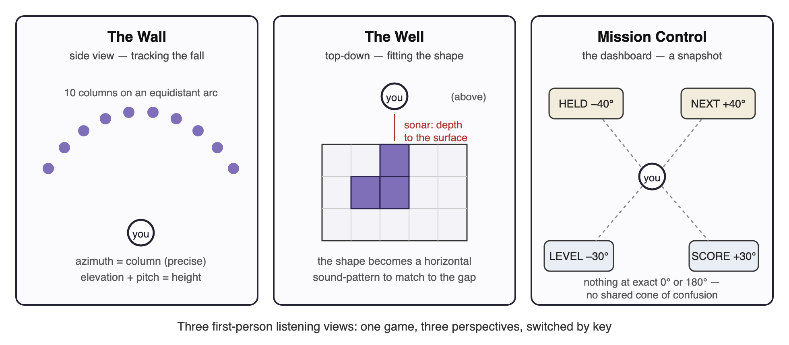
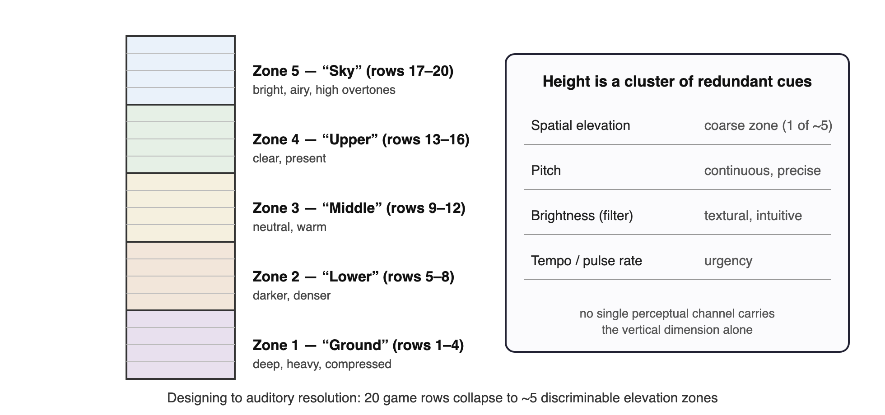

# Accessible Tetris: A Case Study

## 1. Introduction: why Tetris?

My PhD thesis used two case studies. The first looked at user and context profiling; the second looked at the rendering of content to match a given profile. Tetris was the second case study, and this document is a self-contained account of it: what the game demands of a player, why conventional assistive technology cannot meet those demands, the interaction metaphors and software architecture I built in response, and what I learned along the way. It closes with the design for a new implementation — one that runs inside an ordinary web page, using spatial audio that browsers can now deliver natively.

I chose Tetris deliberately, to be difficult. The classic static view of content embodied in the web's document models, and in operating-system "accessibility layers", is a solved problem by comparison. A dynamic, animated game with retained state, random elements, and hard timing is a challenge of a different order — and what really defeats existing assistive technology is the *proximal* content inherent in the game: rotating and guiding falling shapes to match gaps in the landscape below. A screen reader can tell you a button's name. It has no vocabulary at all for "the T-piece is two columns left of a T-shaped hole and falling fast". If an approach to accessibility claims to be better than existing assistive technology, this is exactly the kind of context where it must prove itself.

Tetris also demanded adaptation both *within* and *between* design spaces — visual, sonic, and haptic. Since the target hardware was an unmodified laptop, haptic adaptation was constrained to user input and its feedback rather than general content presentation, which concentrated the research question wonderfully: can the full state of a real-time spatial game be delivered through sound?

Two outcomes interested me: the impact on user-interface design of designing *for adaptability*, and the practical ease (or otherwise) of adapting content to match user capability and context. A degree of failure was expected — particularly where time-critical, contemporaneous information streams meet the comparatively low bandwidth of the sonic design space. That expectation shaped the architecture, as later sections show.

This revision of the case study also does something the original could not: it holds the work up against the wider record — the cognitive science of Tetris, the accessible-games literature, and what players and studios have built since. Section 11 gives that reckoning honestly: where the record supports these concepts, where it challenges them, and what I simply had not considered.

## 2. The game

There are many variations on the classic 1985 game. Modern licensed versions conform to the Tetris Guidelines controlled by The Tetris Company; the guidelines themselves are available only to licensees, but community documentation derived from studying licensed games describes them well.

The essentials: the game is about managing falling bricks so that they form complete horizontal lines within the playing area. Each completed line disappears and scores points; completing multiple lines simultaneously multiplies the score. The falling bricks are one of seven defined shapes — the tetrominoes — each constructed within a 4 × 4 frame and occupying exactly four squares of it.

The playing area is a visible grid of 10 columns by 20 rows, with two hidden rows at the top in which pieces begin their fall. As a piece falls the player may move it left and right and rotate it, subject to rotation rules that vary between versions; modern licensed games use the Super Rotation System (SRS). A piece falls until it reaches the bottom row or is impeded by an already-fallen piece; for a short period after landing it remains movable — it is possible to slide a piece sideways under an overhang, and potentially for it to begin falling again. Once the piece times out into its **locked** position, the next piece begins to fall. The game ends when the stack reaches the top of the visible area so that a new piece cannot begin its descent.

The next shape is always known to the player. The Guidelines add a **hold** box: the current falling piece may be swapped out, once, for either the previously held piece or (if the box is empty) the next piece. Modern versions also require a **ghost** piece — a translucent projection showing where the current piece would land if hard-dropped, supporting the **hard drop** control for players happy with that position. Ten levels of play raise the fall speed every ten completed lines. Control on a PC is by keyboard, with specific keys mandated by the Guidelines, and press-and-hold auto-repeat on lateral movement. Finally there are the corner cases — literally: rules for rotating a piece perched against the corner of another, the celebrated **T-spins**, which score bonus points.

The game as specified is almost completely visual, demanding visual pattern-matching in a time-limited environment. The sound specification is limited to requiring particular Russian folk music. Haptically, the game is optimized to key presses. That asymmetry — everything in one design space, almost nothing in the others — is precisely what made it the right case study.

One thing has changed since I first wrote this description: the stacker community has codified the modern game far more precisely than the leaked-guideline documents of the 2000s. SRS kick tables, the 7-bag randomizer, DAS/ARR movement-tuning conventions, and T-spin scoring are now community-documented standards, with open implementations (NullpoMino most completely) serving as de-facto behavioural references. A new implementation that wants credibility with stacker players as well as accessibility players inherits that fidelity checklist — behavioural correctness is now checkable, not a vibe.

## 3. What Tetris asks of the player

Tetris is a deceptively simple game that places significant cognitive load on the player, especially as speed picks up. The player is expected to:

a) Recognize seven basic tiles.
b) Follow the movement of one tile down the playing area whilst assessing its landing position.
c) Match the outline of a moving tile to gaps in the silhouette at the bottom of the playing area.
d) Optimize that match to fill horizontal lines in order to score points.
e) Optimize that match to take account of the known next tile.
f) Optimize that match to take account of how some tiles can rotate around the corners of obstacles.
g) Optimize that match to fill more than one line simultaneously, for the score multiplier.
h) Optimize that match by holding, and later re-using, currently unsuitable tiles.
i) Match not only vertical gaps in the silhouette but horizontal gaps related to its raggedness.
j) Continue to succeed at (a) through (i) whilst the game speed increases.

### Contemporaneous elements

In terms of game state, there are nine elements alive at once:

a) The current tile, its relationship to the playing area, and the time it has dwelled at its position (for game speed and for the lock timeout).
b) Previous tiles still visible in the playing area — the current silhouette.
c) The relationship of the current tile to its ghost position relative to the silhouette.
d) The shape of the next tile.
e) The shape of the held tile, if any.
f) The current level.
g) The number of lines completed.
h) The current score.
i) Historic high scores.

Their importance varies through the game. While a tile is falling, the player needs (a) through (e); (f) through (i) matter once a tile has locked and line-completeness has been determined. That still leaves **five contemporaneous information channels** during the fall, some far from trivial — the tile-to-landscape relationship is a continuously changing spatial judgement. A sighted player absorbs all five in a single glance. This, condensed to one sentence, is the whole accessibility problem: *vision is a parallel medium and sound is a serial one*, and any sonic rendering must ration what it says.

### Timing considerations

Five distinct timeouts operate inside the game:

a) Dwell time for a falling tile as it passes through each row.
b) The lock timeout when a falling tile meets an obstruction.
c) The delay before the next tile appears after the current one locks.
d) The auto-repeat rate for move-left and move-right.
e) The key dwell time needed to recognize a press at all.

Each is impacted by user capability and by device capability. This list turned out to be architecturally load-bearing: every one of these timings eventually became a *negotiation* between the game and the user interface rather than a constant, for reasons Section 7 explains. It is worth noting the scale of the eventual accommodation: in the working PhD implementation, the per-row fall delay ran at 300 ms in the visual configuration and 4,000 ms in the sonic one — the same game, thirteen times slower, and still recognizably Tetris.

## 4. Why existing assistive technology fails here

Metaphor — with its relatives metonym and synecdoche — plays a central role in guiding expectation in user interfaces: the desktop metaphor organizes data; traffic-light colours present line quality; a scrollbar presents relative position. Most interfaces yield up a large number of metaphors on inspection, with no guarantee of consistency between applications ("pages" in a browser and a word processor behave quite differently under zoom).

Conventional assistive technology — screen readers, zooming tools — relies on *automated transliteration* between the default presentation and one suited to the user. Its success depends on how well it interprets the default presentation, including content expressed only through metaphor. As Barbosa put it, "the appropriateness and sophistication of interpretations is directly proportional to the expressiveness of the underlying domain models". A screen reader would need the domain model of the platform *and* of every application, including each one's metaphors. In practical terms it can't have them. So screen readers transliterate little beyond the well-known metaphors of the host platform, and content carried by scalar representation or relative geometry is largely lost.

The platform "accessibility layers" (Windows, macOS, Java) expose *instances of presentation elements*, with some alternative content — but not a model of the interface, and not the mapping between content and presentation. That mapping is left for the AT vendor to hard-code, version by version.

Now hold Tetris up against that machinery. Nearly everything that matters in the game is exactly the kind of content transliteration loses: the silhouette is relative geometry; the fit between piece and gap is proximal, spatial, and continuous; urgency is carried by animation timing. A screen reader pointed at Tetris can say the score. It cannot say the game.

The conclusion I drew — and the thesis of the wider research — is that accessibility of this kind of content cannot be retrofitted by inspection from outside. The application must be built over an *abstract model* of itself, with rendering — in whatever design space suits the user — treated as a service that consumes that model. Accessibility becomes an architecture, not a layer.

## 5. A vocabulary of game presentation metaphors

The first thing to strike me when dealing with Tetris as a developer was the lack of standardized metaphors for expressing computer games. I was so used to thinking in HTML for the web that I felt almost naked without the familiar document metaphor — headings, paragraphs, tables, divisions — supporting description and rendering. So the first task was to identify common presentation metaphors in games, as they apply to Tetris:

**Cockpit and head-up display.** Classic Tetris is a cockpit: the playing area surrounded by instruments. A ghost piece overlaid on the playing area is head-up display; a version with both is a combination of the two.

**Immersive and observational.** In an immersive game the user is at the centre of the action with a restricted field of view — the first-person shooter. In an observational game the user is an omnipotent observer of the whole playing area — Tetris, Pac-Man, Manic Miner. Hold this distinction; it becomes the pivot of the entire case study.

**Sprite-based animation.** Elements perceived as appearing, moving within, and leaving the playing area. I identified eleven non-exclusive aspects of sprite behaviour: game-influenced; user-influenced; sprite-influenced; time-limited; morphing; translucent (the ghost); opaque; synchronized; handshaking (the tessellation of tile against landscape); pregnant (a locked tile separating into its four squares); and borg (those squares merging into the silhouette). A falling Tetris tile is simultaneously game-influenced, user-influenced, sprite-influenced, morphing, opaque, handshaking, pregnant, and borg. Each aspect has properties and potentially its own life-cycle describable as a finite state model — a sprite may take on and shed aspects as it moves through its life. The sprite has a state model, and so may each aspect of its behaviour.

**Canvas-based and grid-based playing areas**, in 2-D and 3-D. Tetris is grid-based 2-D: sprites jump a perceptible cell at a time, emphasizing the grid.

**Gravity.** Things *fall*, rather than merely move toward the bottom of the screen. You could play Tetris rotated ninety degrees, but the metaphor is emphatically falling bricks.

**History.** The last *n* actions are remembered; the silhouette is the game's accumulated history made visible.

**Elapsed time.** From game start (Tetris) or first move (chess) — and chess reminds us there may be several clocks at once.

This taxonomy did real work: it is what the adaptive renderer selects *against*. In the thesis's terms, characteristics of the underlying content are matched to **Design Language Sets** — coordinated groups of interaction modalities, analogous to design patterns or web templates — and the taxonomy above is the vocabulary in which Tetris's characteristics get stated.

## 6. Inventing the sonic design space

With the visual rendering essentially a re-implementation of classic Tetris, the research weight fell on the sonic view. There was no existing vocabulary to borrow: the sonic components and their interaction metaphors were almost entirely new to Tetris, expressing abstract concepts such as gravity, orientation, topography, and relative distance. These are the metaphors I invented for the PhD implementation, together with honest field notes on how each survived contact with reality. The implementation ran on an ordinary laptop, in Java, with JOAL (OpenAL bindings) providing positional audio — an engine whose limitations themselves shaped the design in instructive ways.

A word on the epistemic status of these field notes, because it matters: they are designer introspection, checked against at most one or two informal testers. When I say a metaphor "works surprisingly well", the honest expansion is *worked surprisingly well for me, its designer, who knew what it was trying to say*. Nothing in this section has been evaluated in the sense the auditory-display literature means by the word — quantitative task measures across users, in the tradition of Brewster's and Walker's work — and the thesis's planned formal evaluation was never run. The notes are hypotheses with one data point each; Section 11 returns to what that means for the new build.

**Aside.** Literally an aside: I whisper the type of the next tile, and the content of the hold box, into the player's right ear. Low-priority peripheral information delivered on a spatially distinct, low-attention channel.

**Musical sonar.** I needed a way to express the quality of the tessellation between the falling tile and the ground. I play a single note for each column of the tile's width, in sequence, around the user; the tune repeats every couple of seconds, or when the user moves or rotates the tile. The higher the note, the better the fit. It works surprisingly well — once you get the idea. New listeners took a while to understand it; a training mode belongs in any future version.

**Dancing margins.** A way to describe the distance of the falling tile from the edges of the playing grid — complicated by the fact that fallen tiles can obstruct movement, so the true "margin" is the distance the piece can actually travel. My solution was to place a sound to the left and right of the user, using 3-D distance to express grid distance. The audio engine's positional quality let me down: I first made the sounds physically "dance" forwards and backwards to help the ears fix their locations, and when even that proved weak, the dance became a dance in *music* rather than location — and oddly, that made the margin positions clearer. The lesson generalizes: when spatialization is poor, redundant musical encoding can carry what position cannot.

**Talking scrollbar.** The old idea of speaking text left-to-right so the listener knows how far through it they are, applied to tile position. Again the 3-D audio was not precise enough — the sound jumped perceptibly — so I scaled it back to three coarse locations: the falling tile's sound plays left, middle, or right in front of the user. Taken together with the dancing margins, it locates the tile in space.

**Direction as direction.** Orientation of the falling tile — essentially north, south, east, west. I could simply speak it, but I was already whispering in the player's ear, so I tried animating a sound *passing* the user in one of four directions. Forward/back motion was unconvincing in the engine, so I rotated the axes 45° to give NW/SE and SW/NE passes — orientation, not true direction, is what matters, so the rotation was harmless. In the end even this failed to earn its keep: the diagonal passes sounded odd and imprecise, and I fell back to speaking the orientation — but in a separate, male voice, distinct from the female voice describing the tile. Two lessons: spatial motion is a fragile carrier for categorical information; and voice identity is itself a usable channel.

**Gravity as waterfall.** The action of falling, and how far there is left to fall, delivered inside an already busy soundscape. My solution was falling water, with volume and pitch manipulated over time so the water feels nearer as the tile descends. I first implemented it as ambient sound and later as a point source — there was a qualitative difference between tweening the volume and tweening the location, in the point source's favour. The metaphor asks nothing of the player: everyone knows what approaching water means.

**Braided audio.** The technique I adapted from the "Audio Hallway" work of navigating large music collections: splice the play-out of several streams into alternating segments. Playing the musical sonar and the dancing margins simultaneously, even from radically different locations, was discordant and distracting — so I serialized them into a braid, and used the braid *ratio* to express priority: two scans of the sonar for every scan of the margins, because tessellation matters more than margins when playing. Braided audio thereby does two jobs at once: it shares a single musical play-out channel, and it encodes relative importance.

The wav assets of the original build tell the same story in miniature: spoken letters and numbers for the asides and scores, water sounds for gravity, and note sets for the sonar — a soundscape barely a dozen samples deep, doing the work of a screenful of pixels.

## 7. The voice of the game: third person becomes first person

What I find most interesting in the created audio metaphors is the effective change in the *voice* of the game. Tetris went from being a third-person observational game to a first-person immersive experience.

And it wasn't deliberate.

The game became immersive because the player became the centre of all interaction modalities. The tile moves relative to the player; the margins are described relative to the tile the player is steering; gravity ebbs and flows *toward* the listener; the sonar plays out *around* them. Realizing I had changed the nature of the game, I went looking for alternative, observational audio metaphors for gravity, tessellation, and relative position — and beyond a screen-reader-style approach with multiple speaking actors, I came up empty. It appears to be in the nature of the sonic design space to be first-person immersive for anything beyond simple linear play-out of content.

The deeper reason emerged when I thought about coordinates. Visual Tetris cheats: it presents a spatial cognitive task as a flat projection on a rectangle, and the player's visual system does the reconstruction. The moment we move to audio we are inherently in a *listener-centric polar coordinate system* — everything is defined by angle and distance from the player. We can't fake a flat rectangle, and we shouldn't try.

If a third-person observational game naturally becomes first-person immersive under sonic rendering, what should happen to the classic WIMP interface? Windows, macOS, and the Linux desktops are all third-person observational visual interfaces, and what today's assistive technology provides is the descriptive, spoken, screen-reader approach — an extremely limited set of metaphors. My experience with Tetris suggests a much richer set is waiting to be explored — but exploiting it requires the UI to be described in abstract terms and rendered according to user need, which leads straight back to the architectural model of this case study.

Looking at assistive technology I had seen deployed, the pattern repeats — adaptation seems only ever to travel one direction, toward immersion. Switch scanning is immersive: the user rides a moving play-out, waiting to strike within a time window. Screen magnification is immersive: the user no longer looks down on content but navigates *within* it. Even page re-ordering for screen reading is first-person, leading the user through content in a chosen order. I cannot think of a first-person modality that becomes third-person observational under adaptation.

There is one place the reverse can happen: adaptation for deaf and hearing-impaired users, where audio's emotional and off-stage content gets re-presented visually — icons for events outside the field of view. First-person becomes third; and something is lost in the translation, because a static icon carries little of the emotive content the sound carried. If timely or emotive information is lost in adaptation, the interface is not wholly accessible — which places a hard requirement on the *quality of the underlying abstract description*: in games, content may need to be described in terms as basic as whether the news is good or bad, so that whatever design space renders it can find an expression with equivalent force.

## 8. An architecture for adaptation

### Domains

The case study models Tetris as a Shlaer-Mellor domain chart. The abstract game is the application domain. Two service domains render it — the Visual View and the Sonic View — each rendering *all, some, or none* of the abstract game according to the capability of the current user. Input is delegated to its own service domain, and models of capability to a User Capability domain, which describes a user's physical and cognitive capabilities — how effectively they can press a location, how easily they can hold a press. One implementation domain appears: the keyboard event model of the implementation language. And one bridge deserves notice: Input connects to the Sonic View, because mechanical input has audible feedback that the sonic rendering must own.

The visual components correspond to the existing Tetris Guidelines; the sonic components are the invented metaphors of Section 6. The renderings are *peers* — neither is the "real" game with the other bolted on. That symmetry is the architecture's whole point.

I should be honest about provenance here: I was not alone in reaching this architecture, and I did not know it at the time. In the same era, Grammenos, Savidis and Stephanidis at FORTH were building what they called *universally accessible games* — *Access Invaders*, *Game Over!* — under a "unified design" methodology: one abstract game, adapting its rendering to player abilities rather than shipping segregated special versions, with their evocative term **parallel game universes** for concurrently playable, differently-rendered versions of the same game. That is this domain chart wearing different clothes. The convergence is *support* — two groups independently concluding that accessibility of dynamic content demands an abstract core with adaptive rendering — but it deflates any claim that the architecture itself was unique to my work. What I still believe was distinctive here is further down the stack: the game clock that waits for the interface, the transaction-scoped request/answer discipline borrowed from telephony, and the treatment of the sonic design space at the level of *metaphor* rather than feature.

### Two approaches to adaptation

Two approaches were envisioned. The **manual** approach built the game with templates defined for a small number of representative user profiles, each selecting appropriate interaction modalities. The **automated** approach considered the constraints and rules necessary for the game to *self-adapt* to user capability and operating context. Both rely on the same abstract description of the game's dynamic operation, independent of how it is rendered or how input is collected; the automated approach was expected to fail more often, since it must itself make the modality-selection judgements a designer makes in the manual approach — and the quality of the metadata attached to the abstract model constrains how well modalities can be grouped into a consistent, comprehensible interface.

### The asynchronous bridge

The interface between game and UI is entirely asynchronous — and must be, because an abstract game has no way of knowing how long a communication with the user will take in any given design space. Even "the game is starting" took significantly different times in the two views (a colour ripple across the grid; a spoken announcement), and the game must synchronize with *both* before dropping the first tile.

This forced a decision with philosophical weight: **can the rendering of the user interface delay the fall of the tile?** My answer was yes. The principle is that the UI adjusts to the capabilities of the user — and if the user cannot receive information within a given timeout, then the game itself must adjust. Accessibility reaches all the way down into the game clock. (A multi-user or augmented-reality game might need the opposite decision, letting the game catch up with the world; single-player Tetris has no world to appease.)

The repeated asynchronous behaviour reduces to a simple pattern: a **request/answer pair with a rendezvous on the answer** — diagrammatically similar to UML sequence charts, but the concept goes back to the CCITT/ITU message sequence charts used to describe telecommunications protocols.

I did not invent that pattern for Tetris. In the mid-1990s I was Software Group Leader on the Ascom PABX — a small digital telephone exchange developed almost entirely with the Shlaer-Mellor method. An exchange is asynchronous communication incarnate, and the project relied heavily on sequence-chart patterns to describe the bridges between domains. Three hard lessons from that work transferred directly to Tetris:

1. **No notification/response pairs.** Every deadlock the analysts created traced back to a server treating its client as a server — so the pattern was banned outright.
2. **The client is fixed.** For any pair of domains, one is client and one is server, and the roles never reverse. A server may send an unsolicited *indication*, which may prompt the client to open a transaction — but the server never opens one.
3. **Only the client starts a transaction.** Where several request/answer pairs complete one client intention, they are wrapped in a database-style transaction so that exception cases can be handled coherently.

Synchronous events between domains had also caused deadlock at Ascom (clients blocked while a server's own onward requests completed), so between domains everything became asynchronous, with clients explicitly busy-waiting on answers where sequencing demanded it.

### Notation: making Moore state models say more

Shlaer-Mellor expresses object behaviour with Moore state models, and the asynchronous patterns above needed to be visible *in* those models. I extended the notation with event prefixes:

* **I:** an indication — no direct response required ("key pressed").
* **R:** / **A:** one half of a request/answer pair; the pair share an event name, prefixed by the (conceptual) target — conceptual, because the game requires the *service* of a user interface without knowing which domains provide it.
* **TS:** / **TE:** transaction start and end; constituent events carry the transaction ID.
* **D:** an internal decision event, generated and consumed within one state model, acted on immediately, ahead of any queued event — the mechanism behind the transient decision states that illuminate the algorithm's branch points.
* **X:** cancel an outstanding request/answer pair — an extension implying the prefixes are not mere annotation but are honoured by the runtime architecture beneath the model.

## 9. The state models

The abstract game needs only two concurrent state models: **Game**, handling the start/stop sequence and the hold box, and **FallingTile**, handling the current tile's descent and determining whether a new tile is needed or the game is over.

The original prototype FallingTile was a simple object listening for a timer tick — the survivor of that version appears in the appendix of the thesis chapter as a page of straightforward Java. The moment FallingTile had to communicate asynchronously with the UI, the simple model broke: the algorithm must pause while the UI does its job. Everything that follows is the price, and the payoff, of that pause.

An early draft of the Game model made the cost visible: the main body — tiles are created and keep falling until the game is over, plus the hold extension — is simple and highlighted; *all the rest* of the model exists to handle termination, complicated by the asynchronous bridge. Three stylizations tamed the complexity:

**Hidden await-states.** A dotted transition labelled `R: FT.cancelFallingTile / A: FT.landscapeUpdate` means: on the cancel request, await that specific answer — and only that answer — before completing the transition. Each dotted line is a hidden state that would otherwise bloat the diagram.

**Interruptibility meta-states.** When hard drop was added, the question arose: if the game is mid-announcement of tile position, should hard drop interrupt the announcement or queue behind it? *Without knowing the character of the current interaction modalities, the answer is unknowable.* Visually, interrupting a grid refresh is free; sonically, interrupting the dancing margins mid-phrase may confuse. So the model itself must carry both strategies: a meta-state ("HARD DROPPING DURING UPDATE") holds the alternatives — serialize after the outstanding transaction, or interrupt it with **X:** — with the choice deferred to rendering time. Modality-dependence reaches into control flow: having selected modalities for a user, the game must adapt its *synchronization policies* to match their characteristics, and without such feedback the conservative rule is that serialization beats interruption.

**Contemporaneous-announcement meta-states.** When a tile lands, the landscape updates and the tile disappears; when a tile falls a row, its height and both margins may all need announcing. Are these simultaneous or sequential? At the abstract level the honest answer is "whichever the user's modalities can deliver" — so the meta-state (e.g. "UPDATING ON LANDING") lists alternatives in preference order: Option 1, concurrent updates (`AND { RA: UI.landscapeUpdate, RA: UI.clearTile }`); Option 2, serialized (`THEN { … }`). The preferred option is concurrency; the fallback is sequence. Expanded to plain notation, each meta-state is a combinatorial fragment that grows with the number of announcements — the stylization is what keeps the model on a page.

One question from this modelling work stayed with me. The single event "tile added to landscape" is a higher abstraction than the pair "update landscape, clear tile" — but at what level of abstraction may an abstract model speak? Position and movement are common concepts; is "landed"? The answer lies in the metadata and ontologies applied to abstract model events — without them, no rendering algorithm could choose its metaphors — and that question formed the starting point for the bridge between the Game and Capability domains.

## 10. What the browser now makes possible

The PhD implementation proved the architecture but fought its platform: JOAL's positional audio was weak enough that three of my seven metaphors had to retreat from spatialization to musical or spoken encoding. Two decades later the platform has caught up. The Web Audio API offers `PannerNode` with head-related transfer function (HRTF) processing in every modern browser — true binaural positioning on ordinary headphones, inside a web page, with no installation at all. That changes what the sonic view can attempt, and it is the foundation of the new implementation this case study now serves.

The design that follows assumes headphones and spatial audio, and it assumes users who retain stereo hearing across the musical registers; as always, the deeper principle is that the user decides how to experience the game. The Russian folk music can go and dance elsewhere: the functional audio *is* the soundtrack.

### Three categories of information

Audio is sequential — the design must ration it. Every piece of game information falls into one of three delivery categories, and keeping them distinct is what prevents replacing visual overload with auditory overload:

* **Ambient/persistent** — always present, continuously updated: the active piece's position and identity, the urgency state.
* **Event-driven** — fires on change: rotation, landing, line clear, level up.
* **On-demand** — player-queried when they have cognitive bandwidth: the silhouette scan, the next piece, the held piece.

Mapping the five in-fall channels of Section 3: the current tile (a) and its ghost relationship (c) are ambient; the silhouette (b) is on-demand plus an automatic replay after each lock; next (d) and held (e) are on-demand. The braided-audio insight survives intact — it has simply become a scheduling policy.

### The sonic palette

Each tetromino gets a persistent tonal identity — not a sound effect but a timbre: the I-piece a pure sine, the O a warm pad, the T a plucked string, S and Z a detuned pair expressing their mirrored tension, J and L related-but-mirrored instruments. Horizontal position maps to stereo azimuth (the zero-learning mapping); descent maps to a falling pitch or closing filter — gravity as waterfall, rebuilt from oscillators; rotation steps through a four-interval motif, so each orientation is heard as a chord position. The ghost is the piece's own timbre processed into an echo — quiet, reverb-heavy, panned to the landing column, with the echo delay shrinking as the piece approaches it, the two sounds converging into an intuitive "about to land". The musical sonar returns as the **terrain scan**: the ten columns played as a rapid arpeggio, pan giving *where* and pitch giving *how high*; raggedness is heard as dissonance, a nearly-complete line as a smooth scale — musical harmony as board state. Urgency is a heartbeat whose tempo tracks fall speed, the lock timeout a distinct accelerating tick, and danger shifts the whole soundscape from major to minor pentatonic — anchoring everything to a pentatonic scale keeps the emergent composition pleasant rather than cacophonous. Line completion resolves it: a horizontal sweep, harmonically stacked by line count — unison, octave, chord, and a full triumphant arpeggio for a Tetris — followed by a replay of the new terrain and a breath of silence before the next piece.

A skilled player keeping a clean board produces calm consonance; a struggling player produces dissonance and driving tempo. The game *sounds like how well you are playing* — an intuitive, emotional read on game state that costs the player no parsing at all.

### Three first-person views

The polar-coordinate realization of Section 7 becomes explicit architecture. The game's information space decomposes into three switchable first-person listening perspectives:

**The Wall** — the side view, and the default, because it is how a novice knows Tetris. The ten columns map onto an arc with the listener at its centre — every column equidistant (no volume bias), maximally separated in azimuth (the ear's best dimension), with height carried literally in elevation. It excels at tracking the fall; it struggles with pattern-matching, which from the side is like judging whether a key fits a lock viewed edge-on.

**The Well** — the top-down view. The listener looks down into the well; the piece is near, the silhouette surface below, and a sonar ping's return time gives the gap depth per column — the sonar metaphor is *native* to this view. The piece's shape becomes a horizontal sound-pattern to align with a horizontal gap-pattern, which is a far more tractable auditory task; rotation is heard as the footprint physically rearranging. This is the strategist's view, at the cost of the fall's kinetic urgency.

**Mission Control** — the dashboard: fixed spatial stations for held piece, next piece, level, lines, and score. It is a snapshot, not a stream — visited in the natural pause after a lock, exactly as a sighted player glances at the score panel.

Switching is by dedicated key, heralded by a short 3-D earcon — brief enough not to affect gameplay. The game does not pause on switch by default (knowing *when* to glance is part of the game), but pause-on-switch exists as an option: the game is complex enough, and the unadapted original deserves respect. Views can also be layered — a primary view at full level with another bled in quietly behind — which the mixing model below makes free.

### Psychoacoustic ground rules

The design is constrained throughout by what ears actually resolve, and my old field notes agree with the textbook figures uncannily well:

* **The X-axis is king.** Horizontal discrimination is around 1–2°; ten columns across a frontal arc are comfortably discriminable. The most important game dimension gets the most precise perceptual dimension.
* **Elevation is coarse.** Vertical discrimination is perhaps 10–20° — in practice about five bands: very high, high, middle, low, very low. Twenty rows collapse to five perceivable zones, so the design works in zones — Sky, Upper, Middle, Lower, Ground, each with its own timbral character — and lets *pitch* carry the fine-grained height, with brightness and tempo as further redundant cues. No single perceptual channel carries critical information alone; and the mixing desk lets each player weight the cues that work for their ears.
* **Avoid pure front/back.** Sounds mirrored across the interaural axis produce nearly identical cues — the cone of confusion. Nothing critical sits at exactly 0° or 180°; every Mission Control station is offset (±40° behind, ±30° front-below) so no two stations share a cone.
* **The wobble.** In life, the brain resolves front/back by micro head movements — which don't happen wearing headphones at a screen. So the game space imperceptibly wobbles: a slow, irregular figure-eight oscillation of the audio listener's orientation, the two axes at incommensurate frequencies (so the pattern never repeats and is never heard as rhythm), amplitude a subliminal 2–4°. This is the direct descendant of my dancing margins — in the PhD build I moved the *sources* to help the ears; now we move the *listener*, and nobody has to hear it happening.

### The player's mixing desk

User agency gets its own architecture. The soundscape is built as independently controllable layers — core piece, ghost, terrain, queue, scoring, tension, events — each with an on/off toggle, volume, density (full ten-column scan versus an abbreviated three-column one), and spatial spread. Presets bundle them: **Minimal** (piece and events only — learn the basics), **Standard** (piece, ghost, urgency, events), **Full** (everything), **Custom** (the whole desk). A new player starts minimal and adds layers as their audio literacy grows; an expert runs the full soundscape. Player-defined information density *is* player-defined difficulty — and it is also exactly the manual-template adaptation of Section 8, with the player as the final authority on their own capability model. The old People/Capabilities/Preferences model becomes the settings store behind the desk.

## 11. The record against my concepts: support, challenge, and blind spots

In 2026 I surveyed what others have said about Tetris and accessibility, the audio-game lineage, the accessible-game-design literature, and the open-source landscape (the full annotated notes live alongside this document). This section is the honest reckoning: this is research, not marketing, and the record cuts three ways.

### 11.1 Where the record supports the work

**The architecture was right — and independently invented.** The FORTH unified-design work (Section 8) is the strongest support precisely *because* it is parallel invention: two groups, unaware of each other, concluded that accessible dynamic content requires an abstract game adaptively rendered per user. When independent lines of work converge on a structure, the structure is probably load-bearing.

**Epistemic action gives the sonar its theory.** Kirsh and Maglio's classic Tetris studies showed that expert players *physically rotate pieces rather than mentally rotating them* — external action is cheaper than internal simulation, so experts offload cognition onto the world. My musical sonar re-scanning on every rotation is exactly this loop rebuilt in sound: the re-scan is the payoff of the epistemic action, restored in another design space. In 2009 I had the mechanism but not the name; the cognitive-science literature had the name all along.

**Tetris really is visuospatial to its core.** Emily Holmes's line of work uses Tetris to disrupt traumatic-memory consolidation *because* the game saturates visuospatial working memory. That is independent experimental confirmation of this case study's central premise: a sonic rendering is not translating decoration, it is re-housing the game's entire cognitive substance.

**The mainstream caught up and validated the instincts.** Forza Motorsport's Blind Driving Assists steer a racing game — a harder real-time spatial problem than Tetris — entirely through layered, player-tunable audio cues: commercial-scale proof that the layered-soundscape approach works. Celeste's assist mode made player-controlled difficulty a celebrated design pattern, which is my mixing desk's philosophy: information density as the player's dial. The Last of Us Part II set full completion without sight, not a side-mode, as the industry bar — the full-game principle as product requirement. And the Audio Game Hub's six-figure download counts document the demand the audio-games community has always asserted.

**The one direct predecessor validates the problem by dodging it.** The only published academic sound-Tetris made the game audible by simplifying it — reportedly to a single piece type. It confirms both that the problem is real and that the obvious escape route exists; my position, then and now, is that a one-piece Tetris is not Tetris. The unified-design school and the disability community's own standards point the same way: adaptation must not amputate.

### 11.2 Where the record challenges it

**Temporal parity — my own numbers are the sharpest critique.** My PhD build preserved every rule and ran the sonic configuration at 4,000 ms per row against the visual 300 ms: a thirteen-fold time dilation. The one academic predecessor simplified the *rules*; I simplified *time*. Criterion (j) of Section 3 — continuing to succeed as speed increases — may simply be unreachable in audio at visual tempos. Is a game whose identity includes time pressure still "the full game" when time-dilated by an order of magnitude? I do not have a clean answer. The most defensible position, and the one Celeste's assist mode models: parity of *rules* is non-negotiable; parity of *tempo* is a per-player setting on a continuous axis, and speed is itself a capability dimension. But the honest corollary must be stated: cross-modal score comparison is then meaningless, and the sonic game is the same game played at a different point in the speed-difficulty space — an accommodation, not an equivalence.

**Audio may invert the expert's cheapest move.** The epistemic-action result supports the sonar — and cuts against the wider design. Physical rotation is a net win for sighted experts *because feedback is instant and free*. In my design, rotation triggers announcements that cost seconds — braided, serialized, possibly queued behind other updates. If rotating-to-see becomes expensive, audio players are pushed back toward the mental simulation that sighted experts demonstrably avoid; the design would punish precisely the strategy that makes experts expert. The consequence is a hard requirement the 2009 design never stated: the rotation-to-fit feedback loop must be the *fastest* path in the soundscape — a sub-second burst, always interruptible by the next rotation — whatever the general interruptibility policy says. Latency budgets, not just modality characters, belong in the capability model.

**Modern AI interpretation weakens the transliteration argument — partly.** My critique of assistive technology rested on Barbosa's dictum that interpretation is bounded by the expressiveness of the interpreter's domain models, and in 2009 that bound was crippling. In 2026, agentic overlays are making *existing* inaccessible games playable by having large models interpret the screen — and large models carry enormous implicit domain knowledge, including of Tetris. An LLM watching the board genuinely can narrate the game. What it cannot do is *re-house* it: interpretation of the visual rendering inherits the visual information architecture — the flat rectangle, the observational stance — and can describe the board but not make it a place around the player. The first-person shift of Section 7 remains beyond transliteration's reach, because it is not a description of the screen at all. But my field's 2009-era claim that AT "cannot catch" metaphor-borne content is now only half true, and this case study's argument must be restated more modestly: interpretation is no longer impossible, it is second-best — and demonstrating *how much* better native abstract-model rendering is has become an empirical obligation rather than an assertion.

**Generic HRTF will under-deliver for some players.** My psychoacoustic rules assume the textbook figures, but the browser's HRTF is one generic head — no individualization — and real listeners vary. Elevation discrimination and front/back resolution will straggle the lab numbers for a meaningful fraction of players; my five elevation zones may still be optimistic for some ears. This does not break the design, because redundant coding was already a rule — but it promotes redundancy and per-user cue weighting from good practice to load-bearing necessity, and it makes the wobble's effectiveness something to *measure*, not assume.

**My own palette has an internal collision.** The PhD musical sonar encoded fit quality as pitch — *higher is better*. The new terrain scan encodes column height as pitch — *higher is taller*, and taller is danger. Walker's auditory-display work established that mapping polarity is an empirical matter that designers guess wrong; here I have two of my own metaphors assigning opposite valences to the same channel. If both survive into the build unresolved, the player meets pitch meaning "good" in one phrase and "threat" in the next. Before implementation, one of three resolutions must be chosen: separate registers/timbres for the two metaphors; retiring pitch-fit in favour of the terrain scan's consonance-as-quality encoding; or retiring the old sonar entirely. This is exactly the kind of defect a design review against the literature is for — I did not see it until the survey forced the two metaphors into one table.

**Nothing here is evaluated — still.** Said plainly in Section 6 and repeated because it is the largest single weakness: every metaphor's pass/fail is one designer's introspection. The field's evaluation standards existed in 2009 (I cited them in my own reading notes) and the thesis planned to apply them; the plan outlived the funding. The new build does not get to inherit "works surprisingly well" as established fact.

### 11.3 What I simply hadn't considered

**Co-design, not just evaluation.** The pattern behind the recent successes is unmissable: Forza's blind-driving assists were built through years of collaboration with blind consultants; The Vale was developed with CNIB consultation. My plans — 2009 and 2026 alike — treated blind players as *evaluators* at the end of the pipeline, not designers at the start of it. Given that I work at CNIB, surrounded by exactly the expertise those studios sought out, this is the most embarrassing gap in the plan and the easiest to fix: the metaphor prototypes of the build's first phase should be co-design sessions, not demos.

**Motor and cognitive access.** My analysis has been vision-first throughout. The standard survey framing — a player must *receive stimuli*, *determine responses*, and *provide input* — exposes the other two barriers. Input: Tetris's timing demands (auto-repeat tuning, lock delay, key dwell) are motor barriers, the one-switch community has adapted falling-block games for single-switch scanning, and my five adjustable timeouts help but no switch-input mode was ever designed. Cognition: my layer model controls *information* density, but rule relaxations in the Celeste sense — larger lock windows, slower progressions, undo — are a different accessibility axis that the capability model claims in principle and specifies nowhere.

**The braille-graphical design space.** A community project has driven a refreshable braille terminal as a 20 × 4 tactile raster for an inverted Tetris. Braille displays as low-resolution *graphical* devices constitute a fourth design space — tactile-graphical, distinct from the vibrotactile haptics I deferred — and my domain chart can host it as naturally as a Braille View service domain. I had never enumerated it.

**Deaf players of *my* game.** Once the functional audio is the soundtrack, game-relevant state — the danger key-shift, the urgency tempo, the lock countdown — lives in sound. A deaf or hard-of-hearing player of my accessible Tetris gets a *worse* game than classic Tetris unless the visual view mirrors that state visually. My own 2009 note on emotive loss in deaf adaptation predicted precisely this failure mode, and seventeen years later I still designed it in. The visual view must render the tension system — not as an accessibility afterthought but because the architecture's symmetry principle demands it.

**The working-memory question.** If visual Tetris consumes visuospatial working memory, what does audio Tetris consume? Spatialized audio may still engage spatial cognition; musical encoding may shift load to auditory-verbal systems; the truth is unknown and testable with exactly the paradigms Holmes's group uses. This is a genuine open research question that the accessible build makes askable for the first time — potentially the project's most novel scientific contribution, and it was not on my list.

**The name.** *Tetris Holding v. Xio Interactive* (2012) settled that game mechanics are unprotectable ideas while their audiovisual expression is protected — which favours this project twice over: the mechanics are free to implement, and my entire purpose is a *different expression*. But Tetris® remains a trademark vigorously enforced; scholarship sits comfortably under nominative use, a playable public release less so. The playable build needs its own name, with "after Tetris" in the description. A decision to make before anything ships, not after.

## 12. From case study to working application

The new implementation is vanilla JavaScript, running in an ordinary web page, and it inherits its architecture directly from this case study:

* **The abstract game** — grid, pieces, SRS rotation, hold, ghost, scoring, and the two concurrent state machines of Section 9, with the request/answer bridge and its decision that rendering may slow the game clock. The five timeouts of Section 3 are all user-adjustable parameters.
* **The visual view** — a clean SVG rendering of classic Tetris: high-contrast and colour-blind-safe schemes, respectful of `prefers-reduced-motion`, fully keyboard-operable, with ARIA live announcements for players using a screen reader alongside partial vision.
* **The sonic view** — the Section 10 design over Web Audio: per-piece timbres, HRTF panning, the three views, the wobble, the layer mixer.
* **The capability layer** — profiles and preferences driving both views' modality selection, presets first, full desk beneath.

The build order mirrors the research logic rather than typical game development: prototype the seven timbres first, then the terrain scan against static boards — can a listener reconstruct the shape? — then the coordinate stage and wobble, and only then the game logic that animates them. The riskiest metaphors get the earliest tests, with a training mode planned from the start; the musical sonar taught me that the best audio metaphors still need learning.

Section 11's reckoning adds five commitments the earlier plans lacked:

1. **Co-design from phase one.** The timbre and terrain-scan prototypes are co-design sessions with blind players, not demos for later validation — the Forza and Vale precedent, and the one my own workplace makes easiest of all to honour.
2. **A latency budget for the epistemic loop.** Rotation-to-fit feedback is the fastest path in the soundscape: sub-second, always interruptible by the next rotation, exempt from the general serialization policy. This is a hard requirement, stated in the capability model, tested from the first playable.
3. **The pitch-collision decision** (sonar's higher-is-better versus terrain's higher-is-taller) resolved before the audio build starts, in the co-design sessions — polarity is an empirical question, so let players answer it.
4. **The visual view mirrors the tension system** — danger key-shift, urgency, lock countdown rendered visually — so the functional-audio soundtrack never makes the game worse for deaf and hard-of-hearing players than the classic it adapts.
5. **A name of its own** before anything playable ships, with the Tetris relationship stated descriptively.

And two entries move onto the research agenda rather than the build plan: a switch-scanning input mode and Celeste-style rule relaxations (the motor and cognitive axes the capability model must grow to cover honestly), and the working-memory question — whether audio Tetris loads the visuospatial resources visual Tetris is known to consume — which the finished build would, for the first time, make experimentally askable.

Two further lessons from the PhD build are carried as requirements rather than hopes. First, every metaphor must be *individually* falsifiable: the old build's honest ledger — sonar worked, margins worked only after retreating to music, direction-as-direction failed into speech — was only possible because metaphors were separable, and the layer mixer preserves that property. Second, evaluation is part of the design: instrumenting the interface for quantitative measures and pairing them with qualitative observation, in the tradition of Brewster and colleagues' mobile-audio usability work, with the open methodological question of validity when comparing across users of different capabilities acknowledged rather than ignored.

The deepest continuity is the simplest to state. In 2009 I concluded that accessible rendering of dynamic content requires an abstract model of the application, rendered per-user by services that the application itself must be willing to wait for. Nothing in two decades has contradicted that — the browsers have simply, finally, provided a sonic design space rich enough to do the architecture justice.

---

### A note on sources

This document consolidates and supersedes several working papers from the PhD period and after: the thesis case-study chapter (*Tetris Case Study*), the metaphor literature review (*Metaphor*), the Design Language Set notes (*Tetris Templates*), the field notes on the audio metaphors and the first-person shift (*First Person*), the final stylized Falling Tile state model (drawn in yEd), the original Java/JOAL implementation, and the design work for the forthcoming web implementation. Section 11 draws on a 2026 survey of the surrounding literature and landscape; the annotated notes, with sources, are in the companion document *Tetris, Accessibility, and Accessible Game Design — Research Notes* ([research.md](research.md)). Tetris® is a trademark of The Tetris Company; this is non-commercial accessibility research, and no Tetris Company assets are used.
